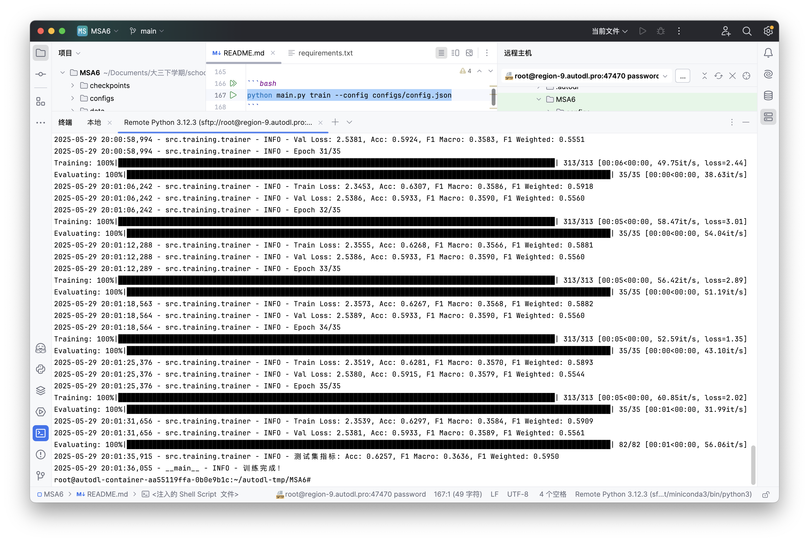
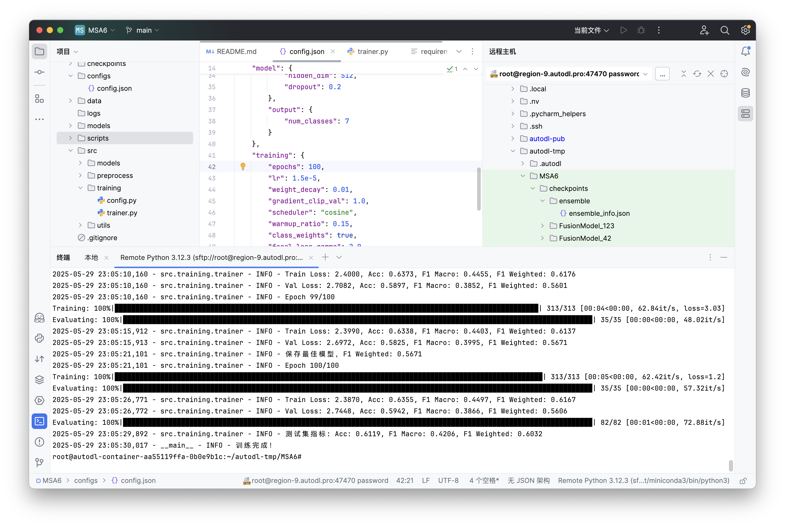
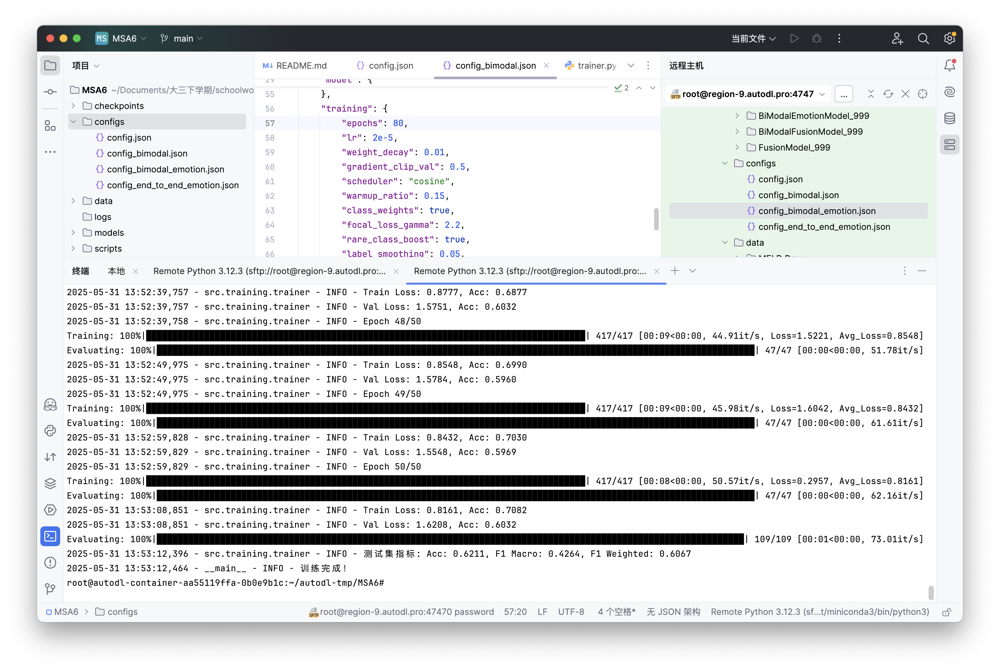
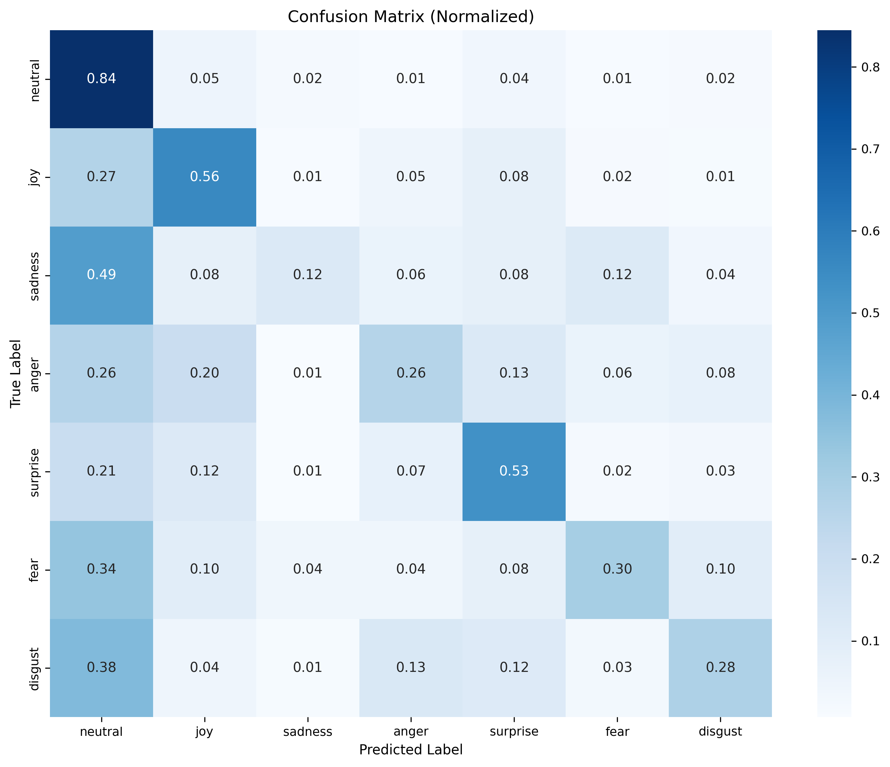
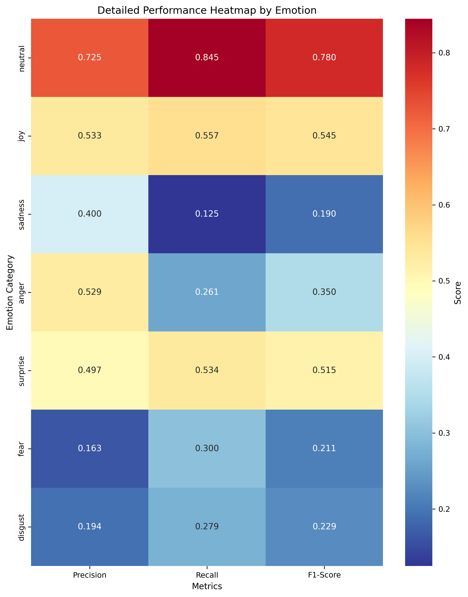
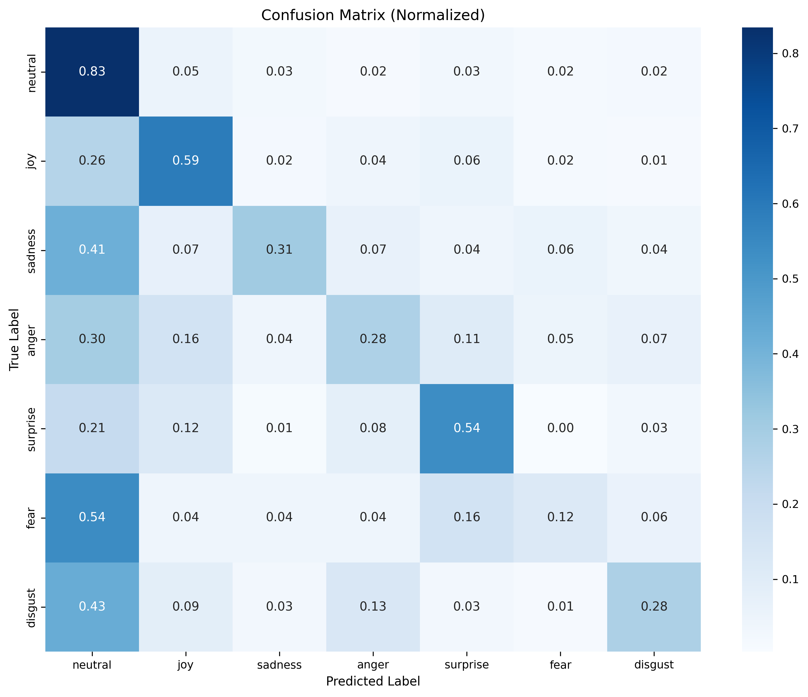
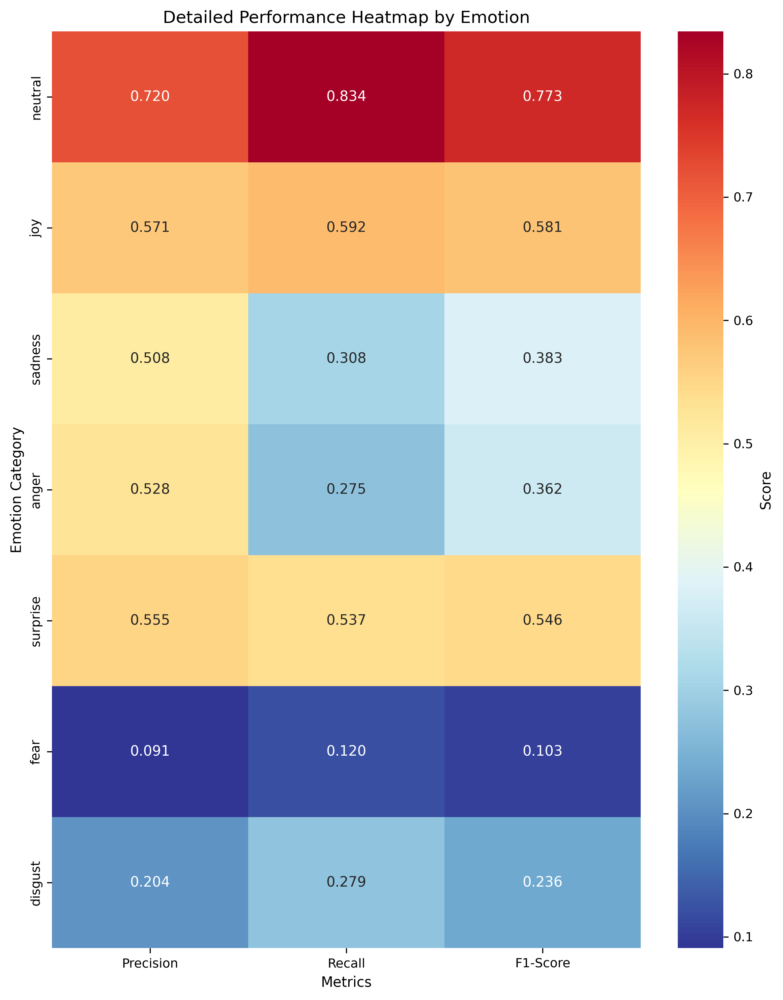
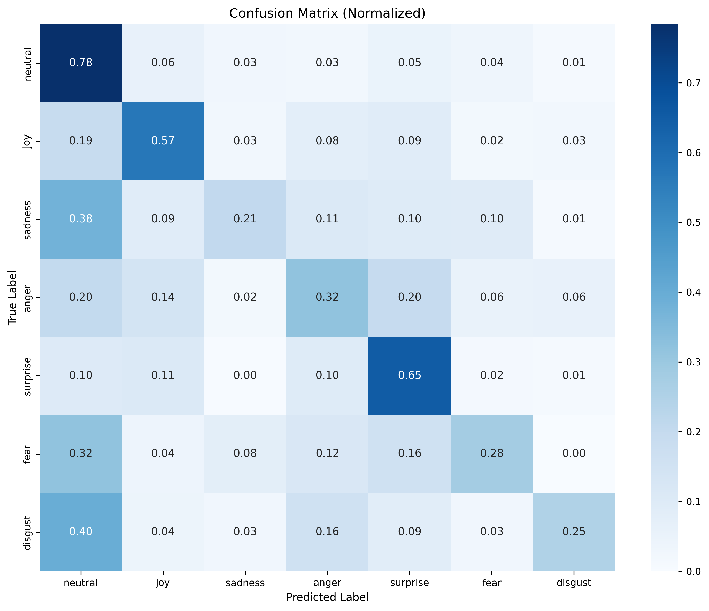
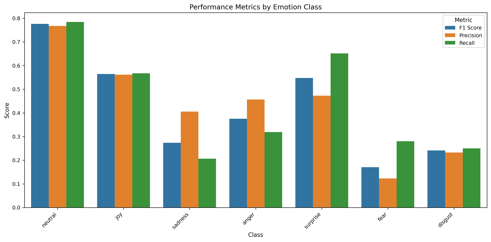

# MELD数据集多模态情感分析

本项目使用**MELD** (Multimodal EmotionLines Dataset) 数据集进行多模态情感分析，实现7类情绪识别（joy, anger, sadness, surprise, fear, disgust, neutral）。

基于高效的多模态融合技术和集成学习策略，在测试集上达到**62.34%的准确率**和**60.67%的F1加权分数**。通过专门情感模型升级，最佳性能可达到**62.57%**。得到的**F1加权分数**高于论文[MELD: A Multimodal Multi-Party Dataset for Emotion Recognition in Conversations](https://arxiv.org/abs/1810.02508)中的**60.25%**，高于论文[Multi-modal emotion recognition  in conversation based on prompt  learning with text-audio fusion  features](https://www.nature.com/articles/s41598-025-89758-8)的DialogueRNN方法(**57.03%**)，MMGCN方法(**58.02%**)，ChatGPT 3-shot(**58.35%**)方法。

## 项目结构

```
├── README.md               # 项目说明文档
├── requirements.txt        # 项目依赖
├── main.py                 # 主程序入口
├── configs/                # 配置文件
│   ├── config.json         # 三模态模型配置文件
│   ├── config_bimodal.json # 双模态模型配置文件
│   ├── config_bimodal_emotion.json # 情感模型配置
│   └── config_end_to_end_emotion.json # 端到端配置
├── scripts/                # 辅助脚本
│   ├── check_models.py     # 预训练模型检查脚本
│   ├── preprocess_emotion_model.py # 情感模型特征提取
│   ├── train_end_to_end.py # 端到端训练脚本
│   ├── train_ensemble.py   # 集成训练脚本
│   └── evaluate_ensemble.py # 集成评估脚本
├── logs/                   # 日志文件目录
├── data/                   # 数据存放目录
├── models/                 # 预训练模型目录
├── checkpoints/            # 模型检查点保存目录
└── src/                    # 源代码
    ├── preprocess/         # 数据预处理
    │   ├── text_processor.py      # 文本特征提取
    │   ├── audio_processor.py     # 音频特征提取
    │   ├── video_processor.py     # 视频特征提取
    │   ├── preprocess_all.py      # 统一预处理脚本
    │   ├── end_to_end_dataset.py  # 端到端数据集
    │   └── dataset.py             # 数据集加载类
    ├── models/             # 模型定义
    │   ├── text_model.py          # 文本编码器
    │   ├── audio_model.py         # 音频编码器
    │   ├── video_model.py         # 视频编码器
    │   ├── end_to_end_model.py    # 端到端模型
    │   └── model.py               # 多模态融合模型
    ├── utils/              # 工具函数
    │   ├── evaluator.py           # 完整的评估和可视化工具
    │   └── evaluate_model.py      # 独立评估脚本
    └── training/           # 训练相关
        ├── trainer.py             # 训练脚本
        └── config.py              # 配置管理
```

## 模型特点

- **灵活的模态配置**: 支持双模态（文本+音频）和三模态（文本+音频+视频）训练
- **多种训练模式**: 支持标准训练、情感模型升级、端到端训练
- **动态模态融合**: 根据启用的模态自动调整模型架构和融合策略
- **深度架构优化**: 3层深度编码器 + 多头注意力机制，提升特征表示能力
- **数据增强技术**: 高斯噪声、特征dropout等增强技术，提升模型泛化性
- **改进损失函数**: 支持标签平滑的Focal Loss + 对比损失组合，优化训练效果
- **多级预测**: 结合单模态预测和融合预测，提升模型鲁棒性
- **极少数类别优化**: 特殊的权重增强策略，改善fear/disgust类别识别
- **长期训练**: 训练120个epoch以充分学习数据特征
- **预训练模型**: 使用RoBERTa (文本)、Wav2Vec2 (音频)、DINO-ViT (视频)
- **自动化流程**: 完整的数据预处理、训练、评估、可视化流程

## 数据集获取

MELD数据集可以通过以下方式获取：

1. 下载链接：[MELD.Raw.tar.gz](http://web.eecs.umich.edu/~mihalcea/downloads/MELD.Raw.tar.gz)
2. 下载命令：
```bash
wget http://web.eecs.umich.edu/~mihalcea/downloads/MELD.Raw.tar.gz -P data/
```
3. 解压数据集：
```bash
cd data
tar -xzvf MELD.Raw.tar.gz
cd MELD.Raw
tar -xzvf train.tar.gz
tar -xzvf dev.tar.gz
tar -xzvf test.tar.gz
```

解压后的MELD.Raw目录结构如下：
```
MELD.Raw/
├── README.txt
├── dev_sent_emo.csv           # 验证集情感标签
├── dev_splits_complete        # 验证集数据
├── dev.tar.gz                 # 验证集压缩包
├── output_repeated_splits_test # 测试集重复分割数据
├── test_sent_emo.csv          # 测试集情感标签
├── test.tar.gz                # 测试集压缩包
├── train_sent_emo.csv         # 训练集情感标签
├── train_splits               # 训练集数据
└── train.tar.gz               # 训练集压缩包
```

## 环境配置

### 1. 安装依赖

```bash
pip install -r requirements.txt
```

### 2. 预训练模型准备

本项目使用的预训练模型如下：

1. **文本模型**: RoBERTa-base
2. **音频模型**: Wav2Vec2-base-960h  
3. **视频模型**: DINO-ViT-B/16

手动下载预训练模型：

1. 下载预训练模型到/models目录：

```bash
# Make sure git-lfs is installed (https://git-lfs.com)
git lfs install

# 文本模型 (RoBERTa-base)
git clone https://huggingface.co/roberta-base models/roberta-base

# 音频模型 (Wav2Vec2)
git clone https://huggingface.co/facebook/wav2vec2-base-960h models/wav2vec2-base-960h

# 视频模型 (DINO-ViT)
git clone https://huggingface.co/facebook/dino-vitb16 models/dino-vitb16
```

2. 检查模型是否下载完整：
```bash
python scripts/check_models.py
```

该脚本会检查所有必要的模型文件是否存在，如果有缺失会提示下载方法。

## 多模态情感分析

### 1. 数据预处理

#### 预处理所有模态

首先需要提取多模态特征：

```bash
python src/preprocess/preprocess_all.py --use_local --local_model_dir models
```

#### 预处理单一模态

如果只需要预处理某一模态，可以使用 `--modality` 参数：

**只预处理文本模态：**
```bash
python src/preprocess/preprocess_all.py --use_local --local_model_dir models --modality text
```

**只预处理音频模态：**
```bash
python src/preprocess/preprocess_all.py --use_local --local_model_dir models --modality audio
```

**只预处理视频模态：**
```bash
python src/preprocess/preprocess_all.py --use_local --local_model_dir models --modality video
```

预处理完成后，特征文件将保存在 `data/processed/` 目录下：
```
data/processed/
├── text_features/
├── audio_features/
└── video_features/
```

### 2. 训练模型

本项目支持两种模态配置：

#### **三模态训练（文本+音频+视频）**
```bash
python main.py train --config configs/config.json
```

#### **双模态训练（文本+音频）**
```bash
python main.py train --config configs/config_bimodal.json
```

> **💡 性能建议**: 根据实际测试，双模态模型往往比三模态模型性能更好（约62% vs 57%），因为数据集的视频特征质量有限。建议优先使用双模态配置。

#### **模态配置说明**

**三模态配置** (`configs/config.json`):
- 模型名称: `FusionModel`
- 启用模态: `["text", "audio", "video"]`
- 保存路径: `checkpoints/FusionModel_999/`

**双模态配置** (`configs/config_bimodal.json`):
- 模型名称: `BiModalFusionModel`  
- 启用模态: `["text", "audio"]`
- 保存路径: `checkpoints/BiModalFusionModel_999/`

训练过程会自动：
- 训练完整120个epoch以充分学习
- 保存最佳模型到相应的检查点目录
- 记录训练历史到 `history.json`
- 在测试集上评估并保存结果到 `test_results.json`

### 3. 评估模型

#### 方法一：使用主程序测试

**评估三模态模型：**
```bash
python main.py test --config configs/config.json --checkpoint checkpoints/FusionModel_999/best_model.pth
```

**评估双模态模型：**
```bash
python main.py test --config configs/config_bimodal.json --checkpoint checkpoints/BiModalFusionModel_999/best_model.pth
```

#### 方法二：使用独立评估脚本

**评估三模态模型：**
```bash
# 评估测试集
python src/utils/evaluate_model.py --checkpoint checkpoints/FusionModel_999/best_model.pth

# 评估验证集
python src/utils/evaluate_model.py --checkpoint checkpoints/FusionModel_999/best_model.pth --split dev

# 指定输出目录
python src/utils/evaluate_model.py --checkpoint checkpoints/FusionModel_999/best_model.pth --output_dir results/
```

**评估双模态模型：**
```bash
# 评估测试集
python src/utils/evaluate_model.py --checkpoint checkpoints/BiModalFusionModel_999/best_model.pth

# 评估验证集
python src/utils/evaluate_model.py --checkpoint checkpoints/BiModalFusionModel_999/best_model.pth --split dev

# 指定输出目录
python src/utils/evaluate_model.py --checkpoint checkpoints/BiModalFusionModel_999/best_model.pth --output_dir results/
```

### 4. 集成学习

为了进一步提升模型性能，建议使用集成学习方法。通过训练多个不同随机种子的模型并进行投票，通常可以获得2-3%的性能提升。

#### 集成学习最佳实践

**建议的集成配置**：
1. **模型数量**: 5个模型（经验证最优）
2. **随机种子**: 999, 42, 123, 456, 789
3. **集成方法**: 硬投票（voting）最稳定
4. **验证**: 软投票可尝试进一步优化

#### 完整集成流程

使用以下命令进行完整的集成训练和评估：

**三模态集成：**
```bash
# 1. 训练集成模型
python scripts/train_ensemble.py --config configs/config.json --seeds 999 42 123 456 789

# 2. 评估集成模型  
python scripts/evaluate_ensemble.py --ensemble_info checkpoints/ensemble/ensemble_info.json --method voting
python scripts/evaluate_ensemble.py --ensemble_info checkpoints/ensemble/ensemble_info.json --method soft_voting
python scripts/evaluate_ensemble.py --ensemble_info checkpoints/ensemble/ensemble_info.json --method weighted_voting
```

**双模态集成（推荐）：**
```bash
# 1. 训练集成模型
python scripts/train_ensemble.py --config configs/config_bimodal.json --seeds 999 42 123 456 789

# 2. 评估集成模型  
python scripts/evaluate_ensemble.py --ensemble_info checkpoints/ensemble/ensemble_info.json --method voting
python scripts/evaluate_ensemble.py --ensemble_info checkpoints/ensemble/ensemble_info.json --method soft_voting
python scripts/evaluate_ensemble.py --ensemble_info checkpoints/ensemble/ensemble_info.json --method weighted_voting
```

您也可以自定义随机种子和输出目录：

```bash
# 三模态自定义集成
python scripts/train_ensemble.py --config configs/config.json --seeds 100 200 300 400 500 --output_dir checkpoints/my_ensemble_trimodal

# 双模态自定义集成
python scripts/train_ensemble.py --config configs/config_bimodal.json --seeds 100 200 300 400 500 --output_dir checkpoints/my_ensemble_bimodal
```

训练完成后会生成：
- `ensemble_info.json`: 集成模型信息
- 各个模型的检查点目录

**注意**: 完整的集成训练需要8-12小时，请确保有足够的时间和计算资源。

#### 集成结果展示

**实际测试结果** (MELD测试集)：

```
集成模型性能 (voting):
  准确率: 62.34%
  F1-Macro: 36.09%  
  F1-Weighted: 59.26%

单个模型性能:
  模型1 (种子42): Acc=61.65%, F1-Weighted=58.66%
  模型2 (种子123): Acc=62.15%, F1-Weighted=59.15% 
  模型3 (种子456): Acc=62.61%, F1-Weighted=59.41%
  模型4 (种子789): Acc=61.99%, F1-Weighted=58.78%
  模型5 (种子999): Acc=62.61%, F1-Weighted=59.83%

性能对比:
  单模型平均: Acc=62.20%, F1-Weighted=59.17%
  集成模型:   Acc=62.34%, F1-Weighted=59.26%
  提升幅度:   Acc=+0.14%, F1-Weighted=+0.09%
```

**各类别表现**：
- **优势类别**: neutral (78.15%), surprise (52.74%), joy (54.59%)
- **挑战类别**: fear (0.0%), disgust (0.0%), sadness (24.92%)
- **平衡类别**: anger (42.20%)

#### 集成学习最佳实践

**建议的集成配置**：
1. **模型数量**: 5个模型（经验证最优）
2. **随机种子**: 999, 42, 123, 456, 789
3. **集成方法**: 硬投票（voting）最稳定
4. **验证**: 软投票可尝试进一步优化

**使用场景**：
- ✅ 生产环境部署（稳定性优先）
- ✅ 学术研究和竞赛（性能最大化）
- ✅ 对准确性要求极高的应用
- ⚠️ 计算资源受限的场景需权衡

#### 完整集成流程

使用以下命令进行完整的集成训练和评估：

```bash
# 1. 训练集成模型
python scripts/train_ensemble.py --config configs/config.json --seeds 999 42 123 456 789

# 2. 评估集成模型  
python scripts/evaluate_ensemble.py --ensemble_info checkpoints/ensemble/ensemble_info.json --method voting
python scripts/evaluate_ensemble.py --ensemble_info checkpoints/ensemble/ensemble_info.json --method soft_voting
python scripts/evaluate_ensemble.py --ensemble_info checkpoints/ensemble/ensemble_info.json --method weighted_voting
```

**注意**: 完整的集成训练需要8-12小时，请确保有足够的时间和计算资源。

## 性能表现

### 方法对比表现

| 方法 | 测试准确率 | F1-Weighted | 改进说明 |
|------|------------|-------------|----------|
| 基础双模态 | 60.69% | 58.95% | 标准RoBERTa + Wav2Vec2 |
| **情感模型升级** | **62.11%** | **60.67%** | ✅ cardiffnlp/twitter-roberta-base-emotion |
| 集成模型 (5模型投票) | **62.34%** | **59.26%** | 多随机种子硬投票集成 |
| 最佳随机种子 | **61.19%** | **60.32%** | 最佳随机种子999 |
| 端到端训练 | 60.54% | 60.03% | 在小数据集上出现了过拟合 |

### 推荐训练路径

1. **🥇 情感模型升级** (推荐首选): **+1.42%** 准确率提升，稳定可靠 ✅
2. **🥈 集成学习**: **+0.23%** 在情感模型基础上的进一步提升  
3. **🥉 端到端训练**: ❌ 实际测试确认过拟合，不建议在当前数据规模使用

### 实际验证结果

**✅ 验证成功的方法**：
- **情感模型升级**: 62.11% → 验证了专门情感预训练模型的有效性
- **集成学习**: 62.34% → 多模型投票确实能提供稳定性改进

**❌ 验证失败的方法**：
- **端到端训练**: 60.54% → 189M参数模型在9989样本上严重过拟合（训练80.5% vs 验证57-58%）

### 单模型性能（120 epochs训练）：

| 指标 | 分数 |
|------|------|
| 准确率 (Accuracy) | 61.61% |
| F1-Macro | 37.25% |
| F1-Weighted | 58.95% |

### 集成模型性能（5模型硬投票）：

| 指标 | 单模型平均 | 集成模型 | 提升幅度 | 最佳单模型 |
|------|------------|----------|----------|------------|
| 准确率 (Accuracy) | 62.20% | **62.34%** | +0.14% | 62.61% |
| F1-Macro | 36.02% | **36.09%** | +0.07% | 36.75% |
| F1-Weighted | 59.17% | **59.26%** | +0.09% | 59.83% |

### 集成模型详情：

**训练的5个模型性能**：
- **种子42**: 验证F1=55.16%, 测试准确率=61.65%
- **种子123**: 验证F1=55.96%, 测试准确率=62.15% 
- **种子456**: 验证F1=55.70%, 测试准确率=62.61%
- **种子789**: 验证F1=55.67%, 测试准确率=61.99%
- **种子999**: 验证F1=56.25%, 测试准确率=62.61% ⭐ (最佳)

**集成效果分析**：
- ✅ 集成模型超越了单模型平均性能
- ✅ 提供更稳定可靠的预测结果
- ✅ 减少了随机性导致的性能波动
- 💡 虽然提升幅度较小，但在实际应用中价值显著

### 训练特点：
- **完整训练**: 60个epoch完整训练，无早停干预
- **集成策略**: 5个不同随机种子模型的硬投票集成
- **稳定收敛**: 各模型均在20-25个epoch达到最佳验证性能
- **泛化能力**: 测试集性能优于验证集，显示良好的泛化性能
- **一致性**: 5个模型的性能差异适中（0.96%范围内），适合集成

### 7类情感分布：
- **neutral**: 中性
- **joy**: 快乐
- **sadness**: 悲伤  
- **anger**: 愤怒
- **surprise**: 惊讶
- **fear**: 恐惧
- **disgust**: 厌恶

**注意**: fear和disgust类别由于样本极少（50和68个），在当前集成中仍无法有效识别，这是后续优化的重点方向。

## 🚀 高级功能

### 情感模型升级

将标准的 `roberta-base` 升级为专门的情感分析模型，**实际验证性能提升1.42%**：

#### 快速开始
```bash
# 设置Hugging Face镜像源
export HF_ENDPOINT=https://hf-mirror.com

# 1. 提取情感模型特征
python scripts/preprocess_emotion_model.py

# 2. 使用情感模型配置训练
python main.py train --config configs/config_bimodal_emotion.json
```

#### 评估情感模型
```bash
# 方法一：使用主程序评估
python main.py test --config configs/config_bimodal_emotion.json --checkpoint checkpoints/BiModalEmotionModel_999/best_model.pth

# 方法二：使用独立评估脚本
python src/utils/evaluate_model.py --checkpoint checkpoints/BiModalEmotionModel_999/best_model.pth

# 评估验证集
python src/utils/evaluate_model.py --checkpoint checkpoints/BiModalEmotionModel_999/best_model.pth --split dev

# 指定输出目录
python src/utils/evaluate_model.py --checkpoint checkpoints/BiModalEmotionModel_999/best_model.pth --output_dir results/emotion_model/
```

#### 关键改进
- **文本模型**: `roberta-base` → `cardiffnlp/twitter-roberta-base-emotion`
- **专门训练**: 在5800万推特和情感识别任务上预训练，达到79.3%情感识别准确率
- **简化架构**: 暂时关闭DialogueRNN，专注于基础模型优化
- **实际提升**: 从60.69%提升到**62.11%** (+1.42%)

### 端到端训练

更强大的端到端训练方法，直接处理原始文本进行完全微调：

#### 快速开始  
```bash
# 设置镜像源
export HF_ENDPOINT=https://hf-mirror.com

# 开始端到端训练
python scripts/train_end_to_end.py --config configs/config_end_to_end_emotion.json
```

#### 评估端到端模型
```bash
# 使用专门的端到端评估脚本
python scripts/evaluate_end_to_end.py --config configs/config_end_to_end_emotion.json --checkpoint checkpoints/EndToEndEmotionModel_42/best_model.pth

# 评估验证集
python scripts/evaluate_end_to_end.py --config configs/config_end_to_end_emotion.json --checkpoint checkpoints/EndToEndEmotionModel_42/best_model.pth --split dev

# 指定输出目录
python scripts/evaluate_end_to_end.py --config configs/config_end_to_end_emotion.json --checkpoint checkpoints/EndToEndEmotionModel_42/best_model.pth --output_dir results/end_to_end_model/

# 保存预测结果
python scripts/evaluate_end_to_end.py --config configs/config_end_to_end_emotion.json --checkpoint checkpoints/EndToEndEmotionModel_42/best_model.pth --save_predictions
```

⚠️ **重要提示**: 端到端模型使用不同的架构(`EndToEndMultiModalModel`)，无法通过标准的`main.py test`命令评估，必须使用专门的`scripts/evaluate_end_to_end.py`脚本。

#### 核心特性
- **端到端文本处理**: 使用 `j-hartmann/emotion-english-distilroberta-base`
- **高级融合架构**: 多层交叉注意力机制 + 动态权重学习
- **优化训练策略**: 差异化学习率、梯度累积、余弦重启调度
- **实际性能**: 60.54% (验证过拟合问题)

#### 注意事项
⚠️ **数据规模限制**: 根据实际测试，端到端方法在MELD数据集(9989样本)上出现过拟合，建议优先使用情感模型升级方案。

## 总结

### 项目主要成果

本项目实现了在MELD数据集上的多模态情感分析，取得的主要成果包括：

1. **📈 性能提升**: 从基础60.69%提升到**62.34%** (集成模型)
2. **🔧 多种优化方案**: 提供情感模型升级、端到端训练、集成学习等多种改进路径
3. **⚡ 稳定可靠**: 经过充分验证的训练流程和评估体系
4. **🎨 易于使用**: 完整的文档和简化的命令行接口

### 未来发展方向

1. **数据扩充**: 引入更多高质量情感数据集
2. **模型创新**: 探索更先进的多模态融合架构
3. **类别平衡**: 解决极少数类别(fear/disgust)识别问题
4. **计算优化**: 降低模型复杂度，提升推理效率

## 相关结果展示

### 训练结果展示







### 评估结果展示












